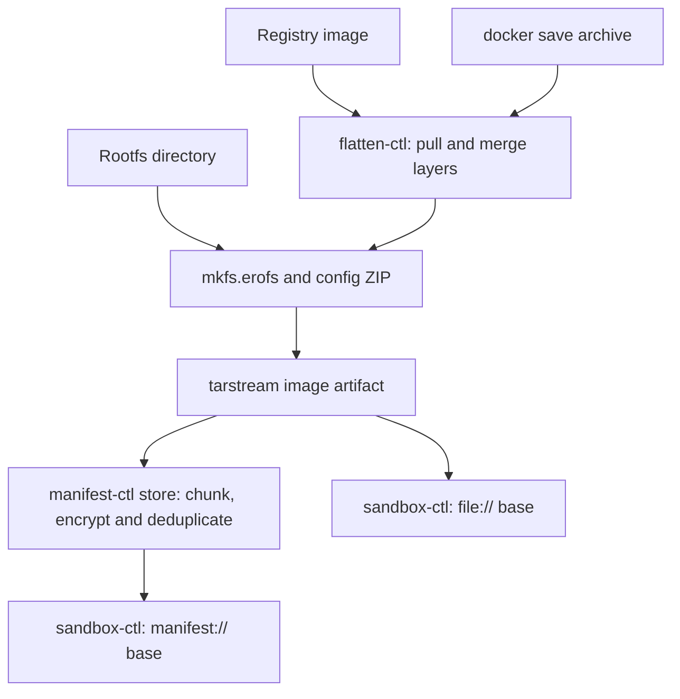

[English](flatten.md) | [简体中文](flatten_zh.md)

# flatten — container-image flattening tool

Merge the layers of an OCI/Docker image into one EROFS filesystem payload, packaged as a **tarstream image artifact** for `manifest-ctl` or the sandbox's read-only `boot.root.base`. A normal `.img` export contains a payload named `image` plus a digest marker; it is not a bare filesystem suitable for direct `mount -t erofs`. Platform readers unwrap it. For a direct filesystem mount, first extract the `image` payload (§2.5, §3.1).

`flatten-ctl` emphasizes **determinism**: the same immutable source, runtime configuration, tool versions and build settings are intended to produce identical payload bytes, keeping downstream chunk deduplication and manifest content keys stable. The payload **embeds the OCI runtime configuration** in a trailing ZIP, so sandbox startup obtains Entrypoint, Env, WorkingDir and other launch settings without a separate index file.

## 1. Overview

### 1.1 Why flatten images

Container images contain several tar layers. A container runtime normally merges them with overlayfs, fuse-overlay or another filesystem mechanism. For the sandbox image path, layers are **merged offline into one EROFS payload**:

- The guest receives a read-only base through vhost-user-blk; it does not assemble the original container layer stack. A writable sandbox can still combine this base with an ext4 upper layer using guest overlayfs.
- Sandboxes can share immutable backing data through the host data/cache paths. The amount of sharing depends on that path and the workload; flattening alone does not guarantee a particular memory-density gain.
- EROFS is read-only and immutable, matching the manifest layer's chunk and content-key addressing.

### 1.2 Inputs and output

Choose one of three inputs:

- **Remote registry image:** a reference such as `nginx:1.27` or `gcr.io/ns/app@sha256:...`. `flatten-ctl` pulls and flattens it directly (§2.3). `FLATTEN_REGISTRY_*` environment variables supply credentials, and layer blobs use a local OCI-layout cache that can be shared across processes.
- **Docker archive:** a tar stream produced by `docker save`, supplied on stdin or from a local file.
- **Already-flattened rootfs directory:** if the positional argument is a local directory, mkfs.erofs reads it in place without a staging-tree copy or source mutation (§2.1). This still reads source data and writes the output.

Arbitrary OCI-layout directories are not accepted as OCI image sources; see §5.5.

The output is **one tarstream artifact**: an `image` payload containing `EROFS + trailing ZIP`, followed by the platform digest marker (§3). The ZIP contains the projected OCI runtime configuration. Registry and docker-archive layers feed the same flattening sink; equivalent uncompressed layers and runtime configuration, built with the same tools/settings, produce the same EROFS payload. Directory export is also deterministic for an unchanged tree and configuration: `-T0 --ignore-mtime` normalizes timestamps in mkfs without modifying the tree. Artifact reproducibility additionally includes the authoritative sparse map and wrapper encoding.

Flattening itself does not sign, encrypt or content-address the data. Optional `--upload` invokes the next manifest-ingest stage, which handles encryption and deduplication; see [manifest.md](https://github.com/kuasar-sandbox/accelerator/blob/main/docs/manifest.md). Do not infer an image-signature verification step from manifest integrity or encryption.

### 1.3 Position in the system



## 2. Command-line interface

The CLI does not provide the `flatten-ctl verify` duplicate-export comparison command. Determinism is checked through unit tests and reproducible Manifest keys.

There are seven subcommands: `export` creates an image artifact with optional upload; `referer` provides atomic OCI Referrers lookup/put operations; `info` inspects a local artifact or `manifest://` reference; `cache` inspects or reclaims the pull cache; `config` prints or validates flatten configuration; `tar` extracts archives or packages one file; and `mountpoint` creates a self bind mount for in-guest export.

| Subcommand | Purpose |
|---|---|
| `export` | Registry image, docker-archive or rootfs directory → deterministic EROFS in a **tarstream image artifact** (`image` entry, conventional `.img` suffix); `--upload` also ingests it into the store and prints the manifest key. |
| `referer` | `lookup` checks for a reusable manifest ID associated with the source image; `put` writes a host-uploaded manifest ID to the source repository's OCI Referrers (§2.3). |
| `info` | Read the payload's EROFS superblock and trailing OCI configuration ZIP through the artifact envelope. |
| `cache` | `cache info` reports occupancy; `cache gc` reclaims by LRU to the requested limit (§2.4). |
| `config` | Print normalized, validated configuration from `--config`/`FLATTEN_CONFIG`, or a `--template` skeleton; `-o <file>` writes a file instead of stdout. |
| `tar` | General tar extraction with exact declared-hole handling, and single-file packaging (§2.5). |
| `mountpoint` | `mountpoint <dir>` performs MkdirAll and a self bind mount, letting `export --skip-mounts` exclude it. Use it for scratch/output when a guest exports its own rootfs, preventing self-inclusion. Linux only; mounting requires the corresponding privilege. |

`export` uses a **positional input argument**. It first recognizes a local directory; directory input rejects the registry/archive forcing flags. Otherwise the default classification is:

```text
1. Omitted or "-"              → stdin docker-archive
2. "docker-archive:<path>"     → local archive, with the prefix removed
3. os.Stat finds a local file  → local docker-archive (./app.tar or /abs/x.tar)
4. Otherwise                  → remote reference parsed by name.ParseReference
```

`--registry` / `--archive` force the non-directory source interpretation when a filename resembles `repo:tag`; the two flags are mutually exclusive. `info` requires a positional artifact path or `manifest://<hex>`. Place positional arguments **after flags**, because Go's standard flag parser stops at the first non-flag argument.

Registry/archive export preserves ownership and permissions (§4.3), so it requires root or `CAP_CHOWN`, checked before expensive pull/extraction. Directory export only needs sufficient tree access because it does not chown the source; exporting a complete rootfs normally requires root. `referer`, `info`, `cache` and `config` do not require elevated privileges.

Progress and diagnostics go to stderr. Stdout carries requested results: the artifact stream, manifest key, or resolved digest with `--print-digest`. Keep these output modes separate in scripts: the current CLI can append a manifest key after an artifact for `--upload --output -`, and `--upload --print-digest` produces multiple stdout values. Use a named `--output` or upload without artifact stdout when capturing a key.

`export` / `cache gc` accept `--no-progress`. Pull progress reports `pull: <done>/<total> layers` for cache misses only; flattening reports `flatten: ...`; upload reports `upload: ...` with percentage and rate. Byte-progress updates are throttled to two seconds.

### 2.1 `flatten-ctl export`

```text
flatten-ctl export [flags] <ref|path|->

  <ref|path|->            Registry reference, docker-archive or rootfs directory;
                          omitted or '-' means stdin docker-archive.
  --output <path|->       Image-artifact output (tarstream, payload image, usually .img).
                          '-' writes stdout and refuses a terminal. Required without
                          --upload; optional with --upload (temporary artifact discarded).
  --upload                Ingest the payload into the store and print its manifest key.
  --manifest-config <p>   Manifest YAML, overriding MANIFEST_CONFIG; needed for --upload.
  --config <p>            Flatten YAML, overriding FLATTEN_CONFIG: tmpdir/platform/
                          tls/cache/referer (§2.3).
  --platform <os/arch>    Override the pull platform (os/arch[/variant]).
  --tmpdir <dir>          Override scratch parent; created if missing. For in-guest root
                          export, use a mountpoint-created directory, so --skip-mounts
                          excludes scratch, including mkfs temporary files.
  --insecure              Registry source: allow plain HTTP; TLS verification is controlled
                          separately by tls.* in the configuration.
  --no-progress           Disable stderr progress.

  # Remote registry source (§2.3)
  --print-digest          Print resolved source repo@sha256:... to stdout;
                          mutually exclusive with --output -.
  --registry / --archive  Force registry / local-archive interpretation.
  # Rootfs-directory source (see below)
  --skip <rel>            Exclude the node and subtree relative to rootfs
                          (mkfs --exclude-path semantics); repeatable.
  --skip-mounts           Exclude mountpoints strictly below rootfs using mountinfo.
  --runtime-config <p>    OCI image config or projected config.json; detected by top-level
                          keys. Omitted means an empty runtime configuration.
```

Typical usage:

```bash
# Remote registry image → one image artifact
flatten-ctl export --output nginx.img nginx:1.27

# Upload directly; stdout is the manifest key. Credentials use the environment.
export FLATTEN_REGISTRY_USERNAME=robot FLATTEN_REGISTRY_PASSWORD=…
flatten-ctl export --upload --manifest-config manifest.yaml --config flatten.yaml \
    registry.example.com/team/app@sha256:… > app.key

# docker save pipeline; omitted input means stdin
docker save myapp:v1 | flatten-ctl export --output my-app.img

# Local docker-archive; input follows flags
flatten-ctl export --output my-app.img ./my-app.tar

# Referrers: on a hit the host can reuse the manifest; after a miss, export/store,
# then write the resulting manifest ID back.
flatten-ctl referer lookup --json --owner "$OWNER" --config flatten.yaml \
    registry.example.com/team/app:v1
flatten-ctl export --output app.img --config flatten.yaml registry.example.com/team/app:v1
APP_KEY=$(manifest-ctl store --manifest-config manifest.yaml app.img)
flatten-ctl referer put --owner "$OWNER" --manifest-id "$APP_KEY" --config flatten.yaml \
    registry.example.com/team/app@sha256:…

# If /tmp is too small, set tmpdir: /var/tmp in flatten.yaml.
flatten-ctl export --output big.img --config flatten.yaml ./big.tar
```

**Rootfs-directory source:** mkfs.erofs reads the directory in place, without staging or changing source metadata. Timestamp normalization uses `-T0 --ignore-mtime` inside the image builder. Ownership preservation needs read access rather than chown capability; run as root to read a complete rootfs. `--skip` and `--skip-mounts` remove the **entire node**, including the excluded directory itself. The raw mkfs output is automatically excluded when it lies under the rootfs; for a final artifact inside a live rootfs, place scratch and output on an excluded mountpoint so a previous artifact cannot be included on a later export. Exporting `/` requires `--skip-mounts` to avoid traversing /proc and /sys. Directory input rejects `--platform`, `--print-digest`, `--registry` and `--archive`.

```bash
# Export a machine/guest root; first create excluded scratch/output (mount privilege required)
flatten-ctl mountpoint /run/flatten-export
flatten-ctl export --skip-mounts --tmpdir /run/flatten-export \
    --runtime-config config.json --output /run/flatten-export/host.img /

# Export a prepared rootfs, excluding its cache; reuse an old image's projection
flatten-ctl info --json old.img | jq .config > rc.json
flatten-ctl export --skip var/cache --runtime-config rc.json -output new.img /srv/rootfs

# Directory → EROFS → store; stdout contains the manifest key
flatten-ctl export --skip-mounts --upload --manifest-config m.yaml /srv/rootfs
```

#### Temporary files and failure handling

Export puts its raw EROFS payload in `flatten-erofs-*.img` under the scratch parent
selected by `--tmpdir`, configuration `tmpdir`, or the system temporary directory
(`TMPDIR`, normally `/tmp`). It releases this file immediately after packing
succeeds and the raw source and artifact writer close, before copying a packed
artifact to stdout or starting upload.

| Resource | Lifetime and failure behavior |
|---|---|
| Internal raw `flatten-erofs-*.img` | Removed after packing, or when export returns an error, including a mkfs failure after partial output. |
| Internal artifact `flatten-image-*.img` | Used by `--upload` without `--output`, or by `--upload --output -`. Removed when export returns, on success or error, including invalid manifest configuration and ingest failures. |
| Named `--output` | Kept on success and failure, including upload failure. Writing directly to this path still creates or truncates it; a packing/write/close failure may leave a partial artifact. Cleanup does not delete or restore it. |
| Input archive, source rootfs, persistent cache, unrelated files and scratch parent | Never removed by export's temporary-file cleanup. The normal persistent-cache eviction policy still applies (§2.4). |

Operational errors reach the outer CLI only after owned resources unwind; the CLI
then prints `error: ...` to stderr and exits with status 1. When a downstream reader
closes stdout, export cleans up its temporary files, reports the broken pipe on
stderr and exits with status 1. Artifact bytes and the existing stdout modes are
unchanged, including the appended key with
`--upload --output -`. Abrupt termination such as `SIGKILL` does not run Go defers
and can leave scratch files; this is cleanup for ordinary success and failure,
not a crash-recovery or stale-file sweeping service.

The maintained lifecycle regressions can be run without root, a registry/store,
network access or a real mkfs executable (Go dependencies must already be cached):

```bash
GOFLAGS=-p=2 GOMAXPROCS=2 go test ./cmd/flatten-ctl
```

They use a small local fake mkfs and per-invocation write/close/upload substitutes
to check failure cleanup, raw-file release before ingest, preserved user files,
CLI exit behavior (including reader-closed stdout pipes and restoration of SIGPIPE
behavior) and exact artifact bytes for the fixture. They do not validate
real EROFS construction or live registry/store integration; those remain covered
by the [E2E procedures](../test/e2e/README.md).

### 2.2 `flatten-ctl info` — inspect an image

```text
flatten-ctl info [--json] [--manifest-config <path>] <path|manifest://hex>

  <path|manifest://hex>          Required local image-artifact path or manifest reference.
  --json                         Machine-readable JSON (default: human-readable).
  --manifest-config <path>       Manifest YAML; needed for manifest:// input,
                                with MANIFEST_CONFIG as the environment fallback.
```

The reader unwraps a local tarstream artifact or opens a manifest stream, reads the EROFS superblock, then decodes the trailing OCI runtime configuration ZIP. The manifest fetch path reads the required chunks for the superblock and ZIP instead of materializing the complete image.

Example human-readable output:

```text
$ flatten-ctl info my-app.img
EROFS image size:  1.2 GiB (1287651328 bytes)
Architecture:      amd64
Os:                linux
User:              app
Entrypoint:        ["/usr/bin/foo"]
Cmd:               ["--config","/etc/foo.yaml"]
WorkingDir:        /app
Env (3):
  PATH=/usr/local/sbin:/usr/local/bin:/usr/sbin:/usr/bin:/sbin:/bin
  HOME=/root
  LANG=C.UTF-8
ExposedPorts:      8080/tcp
Labels:
  com.example.version=1.2.3
```

Example JSON:

```json
{
  "erofs_size": 1287651328,
  "config": {
    "Architecture": "amd64",
    "Os": "linux",
    "User": "app",
    "Env": ["PATH=...", "HOME=/root", "LANG=C.UTF-8"],
    "Entrypoint": ["/usr/bin/foo"],
    "Cmd": ["--config", "/etc/foo.yaml"],
    "WorkingDir": "/app",
    "ExposedPorts": {"8080/tcp": {}},
    "Labels": {"com.example.version": "1.2.3"}
  }
}
```

If the payload has no ZIP trailer, `config` is `null`, and human-readable output says `(no OCI config trailer)`. A legacy bare EROFS file still needs the platform envelope for the current local `info` path.

Useful pipelines:

```bash
# Read the projected config through the artifact envelope
flatten-ctl info --json my-app.img | jq .config

# Select just Entrypoint
flatten-ctl info --json my-app.img | jq '.config.Entrypoint'
```

To use a ZIP tool directly, extract the raw `image` payload first (§3.1).

### 2.3 Remote pulling, local caching and Referrers writeback

For a registry input (§2), `flatten-ctl` uses [go-containerregistry] to pull and flatten directly, without `docker save`. Registry behavior comes from **`--config` YAML** or `FLATTEN_CONFIG`; credentials stay outside the file:

```yaml
tmpdir: ""                     # Per-run scratch parent; empty = $TMPDIR or /tmp
platform: linux/amd64          # Empty = linux/$GOARCH; --platform overrides
insecure: false                # Allow plain HTTP; does not disable TLS verification
pull_jobs: 4                   # Parallel layer downloads, serial layer application
tls:                           # HTTPS verification for registry and CDN redirects
  ca_cert: ""                  # Extra trusted PEM CA bundle; may contain several certs
  insecure_skip_verify: false  # Disable certificate verification; prefer ca_cert
cache:
  dir: ""                      # Persistent OCI layout; empty = temporary, cleaned on exit
  max_size: 10GiB              # LRU limit; "0" = unlimited, except explicit cache gc
referer:
  validity: 720h               # Optional expiry interval written by referer put
```

The artifact type is fixed at `application/vnd.kuasar.flatten-manifest.v1` and cannot be configured, ensuring tools and versions use the same identifier.

**Credentials, with anonymous fallback:** use `FLATTEN_REGISTRY_TOKEN` for Bearer authentication, which takes precedence, or `FLATTEN_REGISTRY_USERNAME` plus `FLATTEN_REGISTRY_PASSWORD` for Basic authentication. With neither, public images are pulled anonymously. Secrets use environment variables rather than argv or configuration files, matching orchestrator's delivery of tenant pull credentials through the build sandbox's exec environment; see [deployment.md](https://github.com/kuasar-sandbox/kuasar-sandbox/blob/main/docs/deployment.md) §5.

**TLS (`tls.*`):** applies to all HTTPS requests, including registry APIs and CDN blob redirects. An intercepting proxy may re-sign either with a private CA that the system trust store does not accept. `ca_cert` appends a PEM CA bundle to the system roots. `insecure_skip_verify` disables certificate verification entirely and is an explicit fallback when the CA cannot be supplied. It is independent of `insecure`, which only permits a plain-HTTP registry and does not change HTTPS verification.

**Local cache:** a standard **OCI image layout** with `oci-layout`, `index.json` and `blobs/<algo>/<hex>`, inspectable with tools such as crane or skopeo. Blob presence by digest determines a cache hit. Downloads verify the digest while streaming and install blobs atomically using temporary-file rename. Multiple processes can share the content-addressed directory. When occupancy exceeds `max_size`, reclamation takes flock and uses LRU (mtime) to reach a low watermark; a grace period protects recently written blobs against concurrent deletion. A shared `cache.dir` enables cross-task reuse; a per-task directory isolates tasks.

**Multiple architectures:** a registry reference can resolve to a manifest index. `platform` selects its concrete image before flattening. `Architecture` and `Os` are copied into config.json (§3.2); flattening itself does not validate that the resulting application can execute on the selected sandbox.

**Determinism:** tags are mutable, including `:latest`; pin `@sha256:` for a reproducible source. `export` reports the resolved `repo@sha256:...` on stderr unless `--no-progress` is set; `--print-digest` also writes it to stdout. A digest pins source bytes, while complete output reproducibility additionally requires the same configuration, toolchain and build settings (§3.3). A tag is only as stable as its current target.

#### Atomic Referrers operations (`referer lookup` / `referer put`)

The resulting manifest ID, the content key returned by ingest such as `--upload`, can be written through the **OCI Referrers API** to the **source image's repository**, providing a registry-side, owner-scoped reuse record. `flatten-ctl` exposes only lookup and put primitives. The caller, such as `node-ctl run-builder`, decides whether to skip export, when to upload, and whether writeback failure fails the build.

```text
flatten-ctl referer lookup --json --owner <owner-token> [--config <p>] [--platform <p>] [--insecure] <ref>
flatten-ctl referer put --owner <owner-token> --manifest-id <64hex> [--validity <dur>] [--config <p>] [--insecure] <subject>
```

`lookup` resolves the source to the platform image digest `D` and probes the OCI 1.1 Referrers API. Output:

```json
{"supported":true,"subject":"repo/app@sha256:...","hit":true,"manifest_id":"..."}
```

- `supported=false`: the registry does not support Referrers; the caller chooses fallback or failure.
- `supported=true, hit=false`: the API exists, but there is no correctly formatted, unexpired record matching the owner. The caller continues export and host-side upload.
- `supported=true, hit=true`: the host can validate and reuse `manifest_id`, avoiding pull/flatten.

`lookup` strictly validates `valid_at`. Missing/malformed timestamps, future import times, expired records and expiry before import are skipped as misses. If several records are valid, the newest import wins.

`put` creates a referrer artifact: an OCI image manifest with subject `D`, the artifact type carried by the config media type, and `owner`/`id`/`valid_at` annotations. It pushes that artifact to the source repository. Push permission is required; the caller decides how failure affects the build.

Referrer annotations:

```text
vnd.kuasar.flatten-manifest.owner    = <hmac-hex> <referer_desc>
vnd.kuasar.flatten-manifest.id       = <manifest_id>                        # Ingest content key
vnd.kuasar.flatten-manifest.valid_at = <import RFC3339>[ <expiry RFC3339>]
```

The host normally computes the owner token as `HMAC-SHA256(key = tenant MANIFEST_KEY, msg = referer.key)`, then passes `<hmac-hex> <referer_desc>`. The guest `referer` command receives only `--owner`; it neither needs nor should receive `MANIFEST_KEY` for these lookup/put operations.

**Prerequisites and exposure:** OCI requires the referrer and subject to share a repository, so `referer put` needs **push access to the source repository**. This suits a tenant-owned registry; writing to a read-only upstream fails. A referrer contains timestamps and changes between writes, while those timestamps are not part of the flattened payload or its manifest ID. For a public base-image repository, readers can see owner token, ID and time. HMAC protects the key and the ID is opaque, but the fact that a particular owner imported that image at a particular time is visible.

[go-containerregistry]: https://github.com/google/go-containerregistry

### 2.4 `flatten-ctl cache` — inspect and reclaim the pull cache

```text
flatten-ctl cache info [--config <p>] [--cache-dir <D>]
flatten-ctl cache gc   [--config <p>] [--cache-dir <D>] [--cache-max-size <S>] [--no-progress]
```

`cache` manages a **persistent** cache with explicit `cache.dir`. The default temporary cache is removed after export and needs no separate GC. `cache info` reports directory, blob count, occupancy and limit. `cache gc` takes flock and reclaims by LRU to the configured or overridden `--cache-max-size` limit; explicit GC with `"0"` empties it except for entries in the grace period. `--cache-dir` overrides the configuration's directory. A long-running installation can schedule GC periodically; export also performs reclamation after pulling. The grace period and concurrent writes mean this is a reclamation policy, not an instantaneous filesystem quota.

### 2.5 `flatten-ctl tar` — tar extraction and single-file sparse streams

Both directions use **pure Go and require no tar executable**:

```text
flatten-ctl tar extract [-f tarfile] [--chown u:g] [--chmod 755] [--dense] [rules...]
flatten-ctl tar stream  [-f tarfile] [--size N] [name-in-tar[:source]]
```

The cross-platform sparse-data rule is strict: **zero-valued data and holes are different**. Holes come only from authoritative filesystem metadata such as SEEK_HOLE or a tar sparse map, never from scanning bytes for zeroes. `--dense` is an explicit extraction request to materialize declared holes as allocated zeroes; ordinary sparse processing does not make that conversion.

**`extract`** handles a general tar stream in one pass, using the standard decoder without staging a pipeline on disk. Regular members are written densely: zero bytes within data remain allocated. Sparse members are detected through PAX sparse 1.0 records or the old GNU `S` type flag, with three paths:

- **`-f` file input:** relocate the member by **entry ordinal** on a second handle through tarstream to recover the sparse map hidden by the standard reader. Punch only declared holes. The standard-reader side seeks past the body, avoiding reading its data twice. This works around the sparse-map API limitation tracked in [Go issue 22735](https://github.com/golang/go/issues/22735).
- **General stdin input:** the standard decoder has consumed the map and staging is forbidden, so extraction reports a **hard error with guidance** instead of silently materializing a 32 GiB sparse member densely.
- **`--dense`:** explicitly disable sparse handling and write standard-library logical bytes densely, including allocated zeroes for declared holes.

Convenient cases use a direct tarstream view. With **no rules and `-f` pointing to a platform artifact** (one payload and a digest marker), the payload is automatically extracted with its declared holes: `tar extract -f image.img`. A **single explicit file rule**, `member[:output-file]`, can preserve holes even from stdin when the destination is a file path, not stdout, a directory or the archive root. If that member is actually a directory, file input falls back to general extraction, while stdin reports guidance. Members containing `..` are skipped with a warning; writes through symlinks are errors. If several rules match, the most specific wins.

Rule syntax is `path-in-tar[:destination]`:

| Form | Meaning |
|---|---|
| `p` | Same internal and external path. |
| `in:out` | Write member `in` to path `out`. |
| `in:-` | Stream member contents to stdout; at most one rule. Hardlink members have no body and produce no bytes. |
| `dir/` | Match the directory and all descendants. |
| `dir/:out[/]` | Rename the directory prefix. |
| `dir/:` | Extract into the current directory. |
| `:dir/` | Map the whole archive root into `dir/`. |

Without rules, extract all entries into the current directory. `--chown` and `--chmod` override ownership or permissions for each written entry; `--no-chown` skips ownership restoration. `--chown` accepts `uid:gid`; numeric values are used directly, while names are resolved against the extraction target's `/etc/passwd` and `/etc/group`, as in Docker `COPY --chown=name`. With CGO disabled, the file-based lookup does not use NSS. A username without a group uses that user's primary group; numeric `1000` maps to `1000:1000`. The node-ctl COPY step uses `extract --dense --chown` to unpack the context tar into guest rootfs; see [Target-aware execution and publication](https://github.com/kuasar-sandbox/orchestrator/blob/main/docs/node-build.md#5-target-aware-execution-and-publication).

**`stream`** wraps **one file** as a tarstream: a sparse payload plus `.kuasar.digest.<hex>` marker metadata, implemented by [accelerator/pkg/tarstream](https://github.com/kuasar-sandbox/accelerator/tree/main/pkg/tarstream). The writer computes the digest while writing the payload, without a second data read. File-source holes come from filesystem metadata (SEEK_HOLE). Stdin **requires `--size N`**, because the tar header precedes data and must contain the size. It streams directly without disk staging and is encoded densely: a one-shot stream has no authoritative hole map, and content is not scanned to invent one. `--size` is only valid for stdin; file size comes from the filesystem.

Argument syntax is `name-in-tar[:source]`:

| Form | Meaning |
|---|---|
| Omitted or `-` | Equivalent to `-:-`: member name `-`, bytes from stdin. |
| `path/to/file` | Equivalent to `file:path/to/file`; use the basename as member name. |
| `:source` | Equivalent to `-:source`. |
| `name:-` | Explicit member name, bytes from stdin. |
| `name:source` | Both are explicit. |

The result is valid tar, readable by `extract`, GNU tar and `archive/tar`. Platform extraction treats the marker as reserved metadata and does not write it out. Declared holes occupy map bytes rather than their logical size in the stream.

```bash
# Sparse snapshot disk → tarstream → restore; transfer data plus metadata, not holes
flatten-ctl tar stream -f snap.tar /var/lib/sandbox/disks/overlay.img
flatten-ctl tar extract -f snap.tar "overlay.img:/restore/overlay.img"

# Pipeline input has an explicit length and needs no intermediate disk file
gen-disk | flatten-ctl tar stream --size $((16<<20)) disk.img:- | flatten-ctl tar extract disk.img:-

# Programmatic sparse maps and random access: accelerator/pkg/tarstream
```

The programmatic API in `accelerator/pkg/tarstream` includes `WriteTo` (any `sparse.Source`, returning the digest computed during writing), `ReadFrom` / `ReadSeekFrom` (exact sparse-map round trips and random access within tar), `SourceFrom` (open a stream as a `sparse.Source` for manifest ingest and other consumers), and `SourceAt` (random access; complete platform artifacts expose their marker through optional `Digester`). This repository and downstream repositories can import it.

## 3. Image format

### 3.1 Byte layout

There are two layers of format. The delivered `.img` file is a tarstream artifact with one `image` payload and a `.kuasar.digest.<hex>` marker. Within the **unwrapped payload**, the layout is:

| Payload offsets | Contents |
|---|---|
| `[0, erofs_end)` | Self-describing EROFS filesystem; the superblock at offset 1024 provides the image size. |
| `[erofs_end, payload EOF)` | Uncompressed (STORED) ZIP archive containing `config.json`, the projected OCI runtime configuration. |

The EROFS and ZIP portions coexist without changing either format:

- **EROFS reader:** reads the superblock at payload offset 1024 and uses `blocks << blkszbits` for the filesystem extent. Bytes after that extent do not belong to the mounted filesystem. A platform vhost-user-blk reader first exposes the payload; direct `mount -t erofs` needs the extracted payload rather than the tar wrapper.
- **ZIP reader:** scans backward from payload EOF for End-of-Central-Directory (EOCD). The appended ZIP's offsets are relative to its own beginning, and supported ZIP readers account for the EROFS prefix. Direct ZIP tools should also receive the extracted payload.

`erofs_end = blocks × (1 << blkszbits)`, parsed from the superblock. EROFS has a defined on-disk byte order and supports cross-host-architecture construction; the guest still needs compatible EROFS features, and the application binaries still need the correct execution architecture.

```bash
# Unwrap the artifact before using a direct filesystem/ZIP tool
flatten-ctl tar extract -f my-app.img image:my-app.erofs
unzip -p my-app.erofs config.json
```

### 3.2 config.json schema

The ZIP's config.json is the runtime-relevant projection of the OCI image configuration. It retains launch fields and omits `created`, `author`, `history`, `rootfs.diff_ids` and other metadata that would introduce unrelated build variation.

Projected schema:

```text
Architecture     string                 (passed through, e.g. "amd64" / "arm64")
Os               string                 (passed through, e.g. "linux")
User             string,omitempty
Env              []string,omitempty
Entrypoint       []string,omitempty
Cmd              []string,omitempty
WorkingDir       string,omitempty
ExposedPorts     map[string]struct{},omitempty
Volumes          map[string]struct{},omitempty
StopSignal       string,omitempty
Labels           map[string]string,omitempty
Healthcheck      *Healthcheck,omitempty   (Test/Interval/Timeout/StartPeriod/Retries;
                                            durations are native nanosecond int64 values)
```

**Why Architecture and Os do not use omitempty:** even empty values are emitted so downstream readers can see that the source omitted them, rather than silently inheriting defaults. `flatten-ctl` performs byte-level conversion; platform compatibility decisions, including amd64 versus arm64, belong to the caller/scheduler.

Unlisted fields such as `OnBuild`, `ArgsEscaped`, `Domainname`, `Hostname`, `AttachStdin`, `Tty` and `MacAddress` are silently discarded because they are not part of this sandbox launch projection.

### 3.3 Sources of determinism

The ZIP portion uses:

- One entry, always named `config.json`.
- STORED mode without compression.
- Fixed modification time `1980-01-01 00:00 UTC`, never wall-clock time.
- Deterministic JSON: lexically sorted map keys, preserved slice order for Env/Cmd/Entrypoint semantics, and omission of optional zero-valued fields.

EROFS metadata normalization is described in §4.3.

Equal runtime projections produce equal JSON and ZIP bytes. **Equal config alone does not imply equal whole-image hashes**: the rootfs data and metadata, selected build tools/options, and artifact sparse map/wrapper must also match. Preserve these inputs when comparing payload hashes or manifest keys.

### 3.4 How sandbox startup uses config.json

Before starting the application, `sandbox-ctl run` reads the trailing ZIP through the `boot.root.base` payload view and uses the projection as a LaunchSpec fallback. Explicit `sandbox.yaml` `launch.*` settings take precedence. Image Env is merged below overrides, and Volumes contribute mounts. With a suitable image Entrypoint/Cmd, `launch.exec` can be omitted. The host consumer implementation is [image-default merging](https://github.com/kuasar-sandbox/sandboxer/blob/main/pkg/sandbox/imageconf.go).

## 4. Algorithm

### 4.1 Layer iteration

The flattening engine's `Source` supplies bottom-to-top layers, each as an **uncompressed tar stream**, plus raw OCI image-config JSON. Two implementations share the deterministic `Build` sink:

- **Docker archive:** its outer tar contains manifest.json, which gives layer order and config path, plus the layer tarballs. Extract into a temporary directory, then open layers in manifest order; gzip layers are transparently decoded.
- **Registry:** [accelerator/pkg/remote](https://github.com/kuasar-sandbox/accelerator/tree/main/pkg/remote) reads blobs through the OCI-layout cache and decodes gzip/zstd according to media type into the same uncompressed layer stream (§2.3).

`Build` applies each layer's entries to a temporary staging rootfs. Upper entries replace lower entries at the same path. Tar ownership and mode, including setuid/setgid/sticky, are restored using chown followed by chmod, because chown can clear setuid/setgid. This requires root/CAP_CHOWN (§2). The image configuration is projected (§3.2) and appended as ZIP after filesystem generation. Directory sources use the separate in-place `BuildFromDir` path (§2.1).

### 4.2 Whiteouts

OCI layers express deletion with special names:

- `.wh.<name>` deletes `<name>` in the same directory, whether file or directory.
- `.wh..wh..opq` makes its directory opaque, hiding lower-layer entries beneath it.

The merge engine recognizes these markers, removes the corresponding staged entries, and omits the markers themselves. The final EROFS contains the merged visible filesystem.

### 4.3 Metadata normalization

These rules keep output reproducible:

| Field | Handling |
|---|---|
| mtime / atime | Normalize staged timestamps to epoch zero; `-T0` fixes EROFS timestamps. Directory export uses `--ignore-mtime` without touching the source. |
| uid / gid / mode | Preserve source values: `/tmp` may need 1777 and a user's home must retain its owner. Layer sources use tar-header chown/chmod and require root/CAP_CHOWN; directory sources read existing metadata. |
| Inode numbers | Assigned by mkfs.erofs in its deterministic traversal. |
| Traversal order | mkfs.erofs uses deterministic lexical ordering. |
| Hardlinks | Reconstruct real staging hardlinks sharing an inode; `-Ededupe` additionally deduplicates data blocks. |
| Extended attributes | Not written: `-x-1` disables them, and layer tar xattrs are not applied. This also means file capabilities or security labels stored in xattrs are not preserved by this path. |

The generated EROFS features depend on mkfs.erofs. The native build pins erofs-utils **v1.9.1** and its source digest. To compare builds across nodes, use the same pinned executable and settings; the `MKFS_EROFS_PATH`/PATH override mechanism can otherwise select a different version.

### 4.4 mkfs.erofs invocation

`Build` runs mkfs.erofs over the staging rootfs with this fixed base argument set:

```text
mkfs.erofs -Ededupe --chunksize=4096 -T0 -b4096 -x-1 \
    -U 00000000-0000-0000-0000-000000000000 --quiet <output> <staging-dir>
```

- `-Ededupe --chunksize=4096` deduplicates blocks within the image and uses chunk-based layout, supporting stable offsets and downstream content-defined deduplication.
- No compression: downstream CDC sees the original data bytes for cross-image deduplication.
- `-T0`, the fixed UUID and `-x-1` remove timestamp, UUID and xattr variation.

Directory export adds `--ignore-mtime` and the selected `--exclude-path` arguments. The builder sets mkfs `TMPDIR` to the raw output's directory, keeping dedup scratch with the configured flatten scratch location.

After filesystem generation, the builder opens the payload for append and adds one STORED `config.json` ZIP entry with the constraints in §3.3. The CLI then wraps the complete payload in tarstream (§3.1).

Build mkfs.erofs from the guest-runtime root with `make -C native-deps erofs`. `make flatten-ctl` builds only the CLI; **`make build` builds flatten-ctl and sandbox-runtime.bundle** and can build or stage the runtime's native inputs. Runtime lookup order for mkfs.erofs is `MKFS_EROFS_PATH`, the flatten-ctl executable's directory, then PATH.

The filesystem format supports creation on a different host architecture. That does not translate application executables or remove the guest kernel's EROFS feature requirements.

## 5. Design decisions

### 5.1 Why EROFS rather than ext4 or squashfs

- **Read-only, immutable base:** EROFS matches content-addressed chunks and reusable backing data.
- **Single payload:** it fits a single image artifact, manifest upload and block-device access; the CLI stages raw output before wrapping or streaming it.
- **Portable on-disk format:** the filesystem can be constructed across host architectures, while applications still need the correct execution architecture.
- **Squashfs comparison:** the platform selects uncompressed, chunk-oriented EROFS for its data and deduplication path. Squashfs can also share immutable backing data; there is no evidence here for a universal density disadvantage.
- **Ext4 comparison:** ext4 supplies the writable upper layer in this platform. A mutable filesystem requires an isolation/COW strategy when used across sandboxes and has its own maintenance considerations, such as fsck. This is the reason for the current EROFS-base/ext4-upper split, not a universal benchmark proving one format denser than every alternative.

### 5.2 Why merge offline instead of stacking container layers at runtime

Offline merging removes the need to assemble the original container layer stack separately for each sandbox. The platform exposes one immutable base through its data path; writable sandboxes may still mount guest overlayfs over that base. It does **not** rely on one host EROFS mount being shared as the guest mount, and no host mount-count density bound is established here.

The cost is an image-build step when the source changes. That work can be performed once in a CI/CD image pipeline and reused by many sandboxes.

### 5.3 Why embed config.json instead of using a sidecar

A separate `app.erofs.config.json` introduces two problems:

- **Split copying/uploading:** operators must keep two files together; omitting one breaks startup metadata.
- **Separate manifest lookup:** a manifest exposes one payload reader, so a sidecar would need its own key and fetch.

ZIP-at-end keeps the filesystem payload self-describing within the one delivered artifact. `manifest-ctl store` can ingest it together, and sandbox startup obtains launch configuration from the same payload. EROFS's self-described extent and ZIP's backward EOCD scan allow the two inner formats to coexist; the outer tarstream supplies the platform artifact envelope.

### 5.4 Why project configuration instead of forwarding it verbatim

OCI image config has many non-launch fields. `created`, `author` and `history` are build metadata; `rootfs.diff_ids` describes layers that no longer exist as separate layers; `OnBuild` is a build instruction rather than a runtime setting. Forwarding them would:

- Introduce unrelated timestamp/build variation into output.
- Change manifest deduplication unnecessarily when history changes.
- Blur the boundary between build instructions and runtime configuration.

An explicit projection makes the supported launch fields predictable for downstream consumers.

### 5.5 Unsupported or deferred features

- **Direct arbitrary OCI-layout input:** registry pulling is supported (§2.3), and the pull cache uses OCI layout, but export does not interpret an arbitrary OCI-layout directory as an image source. Convert it with `skopeo copy oci:./dir docker-archive:x.tar`, or push with crane and pull from the registry. Passing that directory as a normal local directory would select rootfs export, not OCI-layout decoding.
- **Image signing/encryption in flattening:** encryption and content addressing belong to the [manifest stage](https://github.com/kuasar-sandbox/accelerator/blob/main/docs/manifest.md). This does not establish an image-signature verification workflow.
- **Layer preservation:** the output merges all layers into one EROFS payload. Downstream manifest chunk deduplication can reuse unchanged content, but it does not preserve the original layer structure.

## 6. Performance characteristics

Build work generally grows with input bytes and file count. Major costs are layer download/decompression, filesystem entry application and mkfs.erofs; cache state, metadata distribution, storage, CPU and tool versions all matter. Appending one uncompressed ZIP entry is small relative to a typical image build, but the repository does not establish a universal 1 GiB/3–5 second or sub-10 ms result.

Check determinism by exporting an immutable input twice with the same configuration/toolchain and comparing payload/artifact hashes as appropriate, or reproducing manifest keys. Unit tests cover deterministic conversion; `verify` is no longer a CLI command (§2).

`flatten-ctl info` does not decompress or load the full EROFS filesystem. It reads the superblock (128 bytes), scans the ZIP tail and decodes the single stored entry through the relevant payload reader. Manifest input can require network/chunk fetches, so latency is not universally sub-millisecond.

## 7. See also

- [accelerator/docs/manifest.md](https://github.com/kuasar-sandbox/accelerator/blob/main/docs/manifest.md): ingest the image into content-addressed storage; chunk deduplication shares repeated content across images.
- [host image-default merging](https://github.com/kuasar-sandbox/sandboxer/blob/main/pkg/sandbox/imageconf.go): how startup uses the embedded OCI runtime configuration.
- [sandboxer/docs/sandbox.md](https://github.com/kuasar-sandbox/sandboxer/blob/main/docs/sandbox.md) `boot.root.base`: select a flattened image as the read-only base.
- [Native-build guide](../native-deps/README.md): build mkfs.erofs with `make -C native-deps erofs`; build the CLI with `make flatten-ctl`. The CLI resolves mkfs.erofs through the explicit environment override, sibling executable or PATH.
- [Project system overview](https://github.com/kuasar-sandbox/kuasar-sandbox/blob/main/docs/kuasar-sandbox.md) §2.2 / §3.1: flattening's role and goals.


Image packing uses `accelerator/pkg/tailzip` to split the EROFS payload and configuration suffix before writing the tarstream envelope. The declared payload commitment covers the EROFS prefix; the suffix has its own metadata commitment. The logical image bytes and deterministic configuration ZIP remain unchanged, while existing artifacts are read with their original declared identities.
