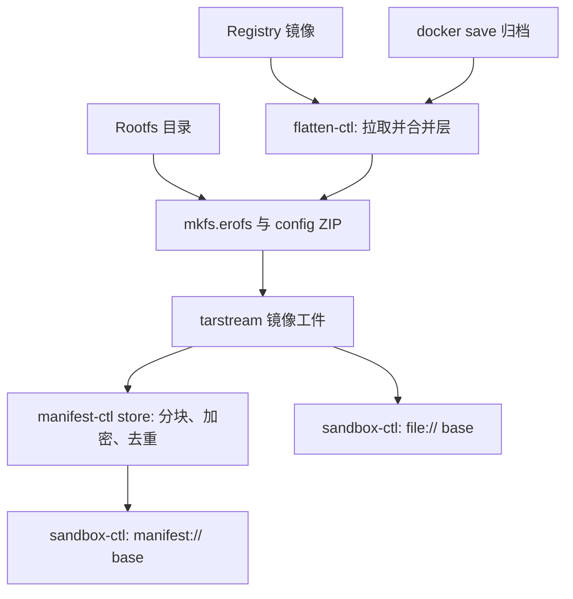

[English](flatten.md) | [简体中文](flatten_zh.md)

# flatten — 容器镜像展平工具

把多层 OCI/Docker 镜像合并(展平)成单个 EROFS 文件系统 payload,再封装成
**tarstream 镜像工件**,供 `manifest-ctl` 或沙箱的只读根 `boot.root.base` 使用。
正常导出的 `.img` 含名为 `image` 的 payload 和摘要 marker,不是可直接交给
`mount -t erofs` 的裸文件系统。平台 reader 负责解封装;直接挂载前须先提取
`image` payload(§2.6、§3.1)。

`flatten-ctl` 强调**确定性**——相同的不可变源、runtime config、工具版本与
构建设置应产出相同的 payload 字节,使后续 chunk dedup、manifest content-key
保持稳定。payload **自带 OCI runtime config**(末尾追加 ZIP),沙箱启动时无需
额外索引文件就能拿到 Entrypoint / Env / WorkingDir 等启动参数。

## 1. 概述

### 1.1 为什么要展平

容器镜像由多个 tar layer 叠加而成,容器运行时通常用 overlayfs / fuse-overlay
等机制合并。沙箱镜像路径选择**离线合并成一个 EROFS payload**:

- Guest 经 vhost-user-blk 使用一个只读 base,无需再组装原容器层栈。可写沙箱
  仍可在 Guest 内用 overlayfs 合并该 base 与 ext4 upper。
- 多个 sandbox 可经 Host 数据/缓存路径共享不可变 backing 数据。实际共享量取决于
  数据路径与工作负载;不能仅凭展平就保证某个内存密度收益。
- EROFS 只读且不可变,与 manifest 的 chunk / content key 寻址一致。

### 1.2 输入与输出

输入,三选一:

- **远程 registry 镜像**——镜像引用如 `nginx:1.27`、`gcr.io/ns/app@sha256:...`;
  `flatten-ctl` 直接拉取并展平(§2.4),拉取凭据经 `FLATTEN_REGISTRY_*` 环境变量注入,
  层 blob 落入可跨进程共享的本地 OCI-layout 缓存;
- **Docker archive**(`docker save` 产物的 tar 流,stdin 或本地文件);
- **已展平的 rootfs 目录**——位置参数是一个本地目录时,mkfs.erofs 直接就地读取
  该目录出图,不复制 staging 树、不修改源树(§2.1 的目录源小节);仍会读取数据并写输出。

(OCI layout 目录暂不直读,见 §5.5。)

输出:**单个 tarstream 工件**,内含 `image` payload(`EROFS + 末尾 ZIP`)及
平台摘要 marker(§3)。ZIP 存放 OCI runtime config 投影。registry 与 docker-archive
两条层源汇入同一 sink;相同的未压缩层和 runtime config 在相同工具/设置下产出
相同的 EROFS payload。目录源也要求源树与配置不变;mtime 由 `-T0 --ignore-mtime`
在 mkfs 层归一,不触碰源树。整个工件的复现还须包含权威稀疏图和容器编码条件。

展平本身不签名、不加密、不做内容寻址。可选 `--upload` 调用下一阶段的 manifest
ingest,完成加密/去重,见[manifest.md](https://github.com/kuasar-sandbox/accelerator/blob/main/docs/manifest.md)。
manifest 完整性与加密不能直接当作镜像签名校验流程。

### 1.3 在系统中的位置



## 2. 命令行接口

七个子命令:`export`(展平为镜像工件,可选直接入库)、`referer`(OCI Referrers
lookup/put 原子操作)、`info`(检视镜像工件 / `manifest://` 引用)、`cache`
(检视/回收本地拉取缓存)、`config`(输出/校验 flatten 配置)、`tar`(通用 tar 提取/封装)、`mountpoint`(自 bind 造挂载点,
guest 内导出配套)。

| 子命令 | 用途 |
|--------|------|
| `export` | registry 镜像 / docker-archive / rootfs 目录 → 确定性 EROFS 的 **tarstream 镜像工件**(条目 `image`,约定后缀 `.img`);`--upload` 时顺带 ingest 进 store 并打印 manifest key |
| `referer` | `lookup` 查询源镜像是否已有可复用 manifest id;`put` 将宿主上传得到的 manifest id 回写到源 repo 的 OCI Referrers(§2.4) |
| `info` | 读镜像工件(经信封)的 EROFS superblock + 末尾 ZIP 里的 OCI runtime config 并打印 |
| `cache` | `cache info` 看缓存占用、`cache gc` 按 LRU 回收到上限(§2.5) |
| `config` | 输出规范化的 flatten 配置(`--config`/`FLATTEN_CONFIG`,加载即校验),或 `--template` 骨架;`-o <file>` 写文件(默认 stdout) |
| `tar` | 通用 tar 提取(全路径声明洞精确)与单文件封装(§2.6) |
| `mountpoint` | `mountpoint <dir>`:MkdirAll + 自 bind,使 `<dir>` 成为挂载点 → `export --skip-mounts` 自动排除之;guest 内导出自身 rootfs 时作 tmpdir/输出落点(防自吞,Linux only) |

`export` 的输入是**位置参数**。先识别本地目录;目录源拒绝 registry/archive 强制
标志。非目录源默认按下列规则判别:

```text
1. 省略或 "-"                → stdin docker-archive
2. "docker-archive:<path>"   → 本地归档文件(剥前缀)
3. os.Stat 命中本地文件       → 本地 docker-archive(./app.tar、/abs/x.tar)
4. 否则                     → 按 name.ParseReference 解析远程引用
```

歧义(本地文件名恰好形如 `repo:tag`)用 `--registry` / `--archive` 强制。`info` 的位置
参数必填,接受镜像工件路径或 `manifest://<hex>`。位置参数须置于 flags 之后(Go stdlib
flag 在首个非 flag 实参处停止解析)。

registry/archive 展平保留属主与权限位(§4.3),需要 root 或 `CAP_CHOWN`,启动时即
预检。目录导出不 chown 源树,只要求足够的读取权限;导出完整 rootfs 通常仍须 root。
`referer`/`info`/`cache`/`config` 不需要特权;`mountpoint` 执行挂载,需要相应权限。

进度与诊断走 stderr,stdout 承载请求的工件流、manifest key 或 `--print-digest`
的 digest。脚本应分开这些输出模式:当前 `--upload --output -` 会在工件之后追加
manifest key,而 `--upload --print-digest` 会输出多个值。捕获 key 时使用命名
`--output` 或不把工件输出到 stdout。`export`/`cache gc` 经 `--no-progress` 关闭进度。
拉取按层打 `pull: <done>/<total> layers`(只计缓存未命中的层),展平按阶段打
`flatten: ...`,`--upload` 上传打 `upload: ...`(百分比+速率);字节型进度 2s 节流。

### 2.1 `flatten-ctl export`

```
flatten-ctl export [flags] <ref|path|->

  <ref|path|->            registry 镜像引用、docker-archive 或 rootfs 目录(省略/`-` = stdin)
  --output <path|->       镜像工件输出路径(tarstream,条目 image,约定 .img);
                          `-` = stdout(终端拒写)。--upload 关闭时必填,
                          --upload 开启时可省(产物默认丢弃,只要 manifest key)
  --upload                展平后把 EROFS ingest 进 store,stdout 打印 manifest key
  --manifest-config <p>   manifest 配置 YAML(覆盖 MANIFEST_CONFIG env);--upload 必需
  --config <p>            flatten 配置 YAML(覆盖 FLATTEN_CONFIG env):tmpdir/platform/
                          tls/cache/referer(详见 §2.4)
  --platform <os/arch>    覆盖配置里的拉取 platform(os/arch[/variant])
  --tmpdir <dir>          覆盖配置 tmpdir(自动创建)。guest 内导出自身 rootfs 时
                          必须指向 mountpoint 子命令造出的挂载点(连同 mkfs 临时
                          文件一起被 --skip-mounts 排除,防自吞)
  --insecure              registry 源:允许 plain HTTP;TLS 证书校验由配置中的 tls.* 独立控制
  --no-progress           禁用 stderr 进度输出

  # 远程 registry 源(详见 §2.4)
  --print-digest          stdout 打印解析后的源镜像 digest(repo@sha256:..);与 --output - 互斥
  --registry / --archive  强制把位置参数当 registry 引用 / 本地文件(消歧)
  # rootfs 目录源(位置参数是本地目录时;见下文)
  --skip <rel>            排除 rootfs 内的该路径(节点连同子树,mkfs --exclude-path 语义);可重复
  --skip-mounts           排除严格位于 rootfs 之下的全部挂载点(/proc/self/mountinfo)
  --runtime-config <p>    追加的 runtime config JSON:OCI image config 或已投影的
                          config.json(按顶层键自动识别);不给则空配置
```

典型用法:

```bash
# 远程 registry 镜像 → 单文件镜像工件
flatten-ctl export --output nginx.img nginx:1.27

# 远程镜像直接入库(stdout 即 manifest key);凭据走环境变量
export FLATTEN_REGISTRY_USERNAME=robot FLATTEN_REGISTRY_PASSWORD=…
flatten-ctl export --upload --manifest-config manifest.yaml --config flatten.yaml \
    registry.example.com/team/app@sha256:… > app.key

# docker save 管道 → 单文件输出(省略位置参数 = stdin)
docker save myapp:v1 | flatten-ctl export --output my-app.img

# 本地 docker-archive 文件(位置参数在 flags 之后)
flatten-ctl export --output my-app.img ./my-app.tar

# Referrers 原子流程:lookup 命中则宿主直接复用 manifest id;miss 后由宿主 export+store,
# 再把得到的 manifest id 回写
flatten-ctl referer lookup --json --owner "$OWNER" --config flatten.yaml \
    registry.example.com/team/app:v1
flatten-ctl export --output app.img --config flatten.yaml registry.example.com/team/app:v1
APP_KEY=$(manifest-ctl store --manifest-config manifest.yaml app.img)
flatten-ctl referer put --owner "$OWNER" --manifest-id "$APP_KEY" --config flatten.yaml \
    registry.example.com/team/app@sha256:…

# /tmp 不够大时在 flatten.yaml 设 tmpdir: /var/tmp,再 --config flatten.yaml
flatten-ctl export --output big.img --config flatten.yaml ./big.tar
```

**rootfs 目录源**。位置参数 stat 为目录时走第三条源:mkfs.erofs **就地读取**
该目录——没有 staging 拷贝,源树永不被修改(时间戳归一靠 `-T0 --ignore-mtime`
在镜像层完成),保留属主只需要对树的读权限(导出完整 rootfs 用 root 跑)。被
`--skip` / `--skip-mounts` 排除的路径**节点整体消失**(目录本身也不在镜像里);
mkfs 的原始输出落在 rootfs 内时会自动排除;最终工件若位于正在导出的 rootfs 内,
应将输出和 scratch 都放在被排除的挂载点,避免下一次导出吞入前一次的工件。
导出 `/` 必须带 `--skip-mounts`(否则会走读 /proc、/sys)。registry 专属 flags(`--platform`/`--print-digest`/
`--registry`/`--archive`)与目录源互斥。

```bash
# 把机器/guest 的根做成镜像;先建立被排除的 scratch/输出挂载点(需挂载权限)
flatten-ctl mountpoint /run/flatten-export
flatten-ctl export --skip-mounts --tmpdir /run/flatten-export \
    --runtime-config config.json --output /run/flatten-export/host.img /

# 从准备好的 rootfs 目录出图,剔除缓存目录;config 直接复用旧镜像里的投影
flatten-ctl info --json old.img | jq .config > rc.json
flatten-ctl export --skip var/cache --runtime-config rc.json -output new.img /srv/rootfs

# --upload 同样可用:目录 → EROFS → store,stdout 打 manifest key
flatten-ctl export --skip-mounts --upload --manifest-config m.yaml /srv/rootfs
```

### 2.2 (已移除)

`flatten-ctl verify` 已移除:确定性由单元测试与 manifest key 的可复现性背书,
双跑比对不再提供增量价值。(§ 编号保留占位,避免跨仓引用重排。)

### 2.3 `flatten-ctl info` — 检视镜像

```
flatten-ctl info [--json] [--manifest-config <path>] <path|manifest://hex>

  <path|manifest://hex>          本地镜像工件路径,或 manifest://<hex>(位置参数,必填)
  --json                         机器可读 JSON 输出(默认人类可读)
  --manifest-config <path>       manifest 配置 YAML;`manifest://` 输入必需,也可由 MANIFEST_CONFIG 提供
```

先解封本地 tarstream 工件或打开 manifest stream,再读 payload 的 EROFS superblock
取得 image size,从末尾 ZIP 解出 OCI runtime config 并打印。`manifest://` 输入经 cache-ctl/store-ctl 的 fetch 路径按 chunk 粒度只读
superblock 与尾部 ZIP,不取回整个镜像。

人类可读输出示例:

```
$ flatten-ctl info my-app.img
EROFS image size:  1.2 GiB (1287651328 bytes)
Architecture:      amd64
Os:                linux
User:              app
Entrypoint:        ["/usr/bin/foo"]
Cmd:               ["--config","/etc/foo.yaml"]
WorkingDir:        /app
Env (3):
  PATH=/usr/local/sbin:/usr/local/bin:/usr/sbin:/usr/bin:/sbin:/bin
  HOME=/root
  LANG=C.UTF-8
ExposedPorts:      8080/tcp
Labels:
  com.example.version=1.2.3
```

JSON 输出示例:

```json
{
  "erofs_size": 1287651328,
  "config": {
    "Architecture": "amd64",
    "Os": "linux",
    "User": "app",
    "Env": ["PATH=...", "HOME=/root", "LANG=C.UTF-8"],
    "Entrypoint": ["/usr/bin/foo"],
    "Cmd": ["--config", "/etc/foo.yaml"],
    "WorkingDir": "/app",
    "ExposedPorts": {"8080/tcp": {}},
    "Labels": {"com.example.version": "1.2.3"}
  }
}
```

payload 无 ZIP trailer 时,`config` 为 `null`,人类模式打印
`(no OCI config trailer)`。旧裸 EROFS 文件仍需平台信封才能走当前本地 `info` 路径。

辅助管道:

```bash
# 经平台工件信封读取 config.json 投影
flatten-ctl info --json my-app.img | jq .config

# 或者经 flatten-ctl info --json 进 jq
flatten-ctl info --json my-app.img | jq '.config.Entrypoint'
```

直接使用 ZIP 工具时,先提取原始 `image` payload(§3.1)。

### 2.4 远程拉取、本地缓存与 Referrers 回写

位置参数判定为 registry 引用时(§2 判别规则),`flatten-ctl` 经 [go-containerregistry]
直接拉取、展平,无需先 `docker save`。所有 registry 行为由 **`--config` YAML**
(或 `FLATTEN_CONFIG` env)配置,密钥不入文件:

```yaml
tmpdir: ""                     # 每次运行临时目录的父目录(空 = $TMPDIR 或 /tmp)
platform: linux/amd64          # 空 = 跟随宿主架构(linux/$GOARCH);--platform 覆盖
insecure: false                # 允许走纯 HTTP 的 registry(dev/私有);不影响 TLS 证书校验
pull_jobs: 4                   # 并发下载层数(下载并行、apply 串行)
tls:                           # HTTPS 证书校验(registry 与 CDN blob 重定向均生效,见下)
  ca_cert: ""                  # 追加信任的 CA bundle 路径(PEM,可含多证书)
  insecure_skip_verify: false  # 完全关闭证书校验(不安全;优先用 ca_cert)
cache:
  dir: ""                      # OCI-layout 持久缓存根;空(默认)= 临时缓存(tmpdir 下,跑完清理)
  max_size: 10GiB              # 上限,超出按 LRU 回收;"0" = 不限,仅手动 cache gc
referer:
  validity: 720h               # 可选;referer put 写入 valid_at 的过期段
```

artifact_type 固定为常量 `application/vnd.kuasar.flatten-manifest.v1`(不可配置,保证跨工具/版本一致)。

**凭据(命名空间环境变量,匿名回落)**:`FLATTEN_REGISTRY_TOKEN`(Bearer,优先)或
`FLATTEN_REGISTRY_USERNAME` + `FLATTEN_REGISTRY_PASSWORD`(Basic);都不设则匿名拉公有
镜像。密钥只走 env(不上 argv、不入配置文件),契合 orchestrator 经 exec env 把租户拉取凭据
下发进构建沙箱的模型([deployment.md](https://github.com/kuasar-sandbox/kuasar-sandbox/blob/main/docs/deployment.md) §5)。

**TLS(`tls.*`)**:作用于全部 HTTPS 请求——既包括 registry API,也包括层 blob 的 CDN
重定向(拦截式代理会用私有 CA 重签这些证书,系统信任库默认拒绝)。`ca_cert` 把额外的
PEM CA bundle 追加进系统信任库,是信任此类私有根 CA 的正路;`insecure_skip_verify`
整体关闭证书校验,仅作 CA 不可得时的逃生口。与 `insecure` 正交:后者只决定 registry
是否可走纯 HTTP,不影响 TLS 校验。

**本地缓存**:标准 **OCI image layout** 目录(`oci-layout` + `index.json` +
`blobs/<algo>/<hex>`),`crane`/`skopeo` 可直接检视。缓存命中判定 = `blobs/` 下该 digest
是否存在(内容寻址,多个 `flatten-ctl` 进程共享同一目录天然安全);blob 边下边校 digest、
原子落盘(temp→rename)。超出 `max_size` 时持 flock 按 LRU(mtime)回收到低水位,并以
grace 期保护近期写入的 blob 不被并发拉取误删。`cache.dir` 指向共享路径即跨任务去重,指向
每任务独立路径即隔离——由调用方按需配置。

**多架构**:registry 引用常指 manifest index,按 `platform` 选出具体 image 再展平;
`Architecture`/`Os` 仍原样投影进 config.json(§3.2),不做校验。

**确定性提醒**:tag 可变,`:latest` 不可复现;可复现构建请钉 `@sha256:`。`export` 把
解析到的 `repo@sha256:..` 打到 stderr(`--no-progress` 关闭),`--print-digest` 另打到
stdout。digest 固定源字节;完整输出复现还需固定配置、工具链与构建设置(§3.3)。tag 的稳定性取决于当前指向。

#### Referrers 原子操作(`referer lookup` / `referer put`)

展平产出的 manifest id(= `--upload` 入库的 manifest 内容键)可经 **OCI Referrers API**
回写到**源镜像所在 repo**,作为 registry 侧、按 owner 作用域的去重备忘。`flatten-ctl`
只暴露 lookup/put 原子能力;是否跳过 export、何时 upload、writeback 失败是否中止,由
调用方(如 `node-ctl run-builder`)编排。

```
flatten-ctl referer lookup --json --owner <owner-token> [--config <p>] [--platform <p>] [--insecure] <ref>
flatten-ctl referer put --owner <owner-token> --manifest-id <64hex> [--validity <dur>] [--config <p>] [--insecure] <subject>
```

`lookup` 解析源 → 平台镜像 digest `D`,直接探测 OCI 1.1 Referrers API。输出:

```json
{"supported":true,"subject":"repo/app@sha256:...","hit":true,"manifest_id":"..."}
```

- `supported=false`:registry 不支持 Referrers API,调用方可按策略 fallback 或失败;
- `supported=true, hit=false`:支持但没有 owner 匹配且格式有效、尚未过期的记录,
  调用方继续 `export` 并在宿主侧上传;
- `supported=true, hit=true`:返回的 `manifest_id` 可由宿主校验后直接复用,无需拉取/展平。

`lookup` 严格校验 `valid_at`。缺失或格式错误的时间、未来的 import 时间、已经到期
或早于 import 的 expiry 都作为 miss 跳过;存在多条有效记录时返回 import 时间最新者。

`put` 构造 referrer artifact(OCI image manifest:subject=`D`、artifact type 经 config
media type 承载、注解 `owner`/`id`/`valid_at`)并推回源 repo。`put` 需要源 repo push
权限;失败由调用方决定是否使构建失败。

referrer 注解:

```
vnd.kuasar.flatten-manifest.owner    = <hmac-hex> <referer_desc>
vnd.kuasar.flatten-manifest.id       = <manifest_id>                        # ingest 产出的内容键
vnd.kuasar.flatten-manifest.valid_at = <import RFC3339>[ <expiry RFC3339>]
```

其中 owner token 通常由宿主计算:`hmac = HMAC-SHA256(key = 客户秘钥 MANIFEST_KEY,
msg = referer.key)`,注解值为 `<hmac-hex> <referer_desc>`。Guest 的 `referer` 命令只接收
`--owner`,lookup/put 操作不需要也不应接收 `MANIFEST_KEY`。

**前提与注意**:OCI 规范要求 referrer 与 subject 同 repo → `referer put` 需对**源
repo 有 push 权限**(面向租户自有 registry;对只读上游写不进会失败)。referrer
artifact 含时间戳,本身每次不同,但展平产物 / manifest id 仍确定。对公开 base 镜像,
referrer(owner token / id / 时间)对能读该 repo 者可见——owner 经 HMAC、id 为不透明内容
键,但"某 owner 在某时刻展平过该镜像"这一事实会暴露。

[go-containerregistry]: https://github.com/google/go-containerregistry

### 2.5 `flatten-ctl cache` — 检视/回收拉取缓存

```
flatten-ctl cache info [--config <p>] [--cache-dir <D>]
flatten-ctl cache gc   [--config <p>] [--cache-dir <D>] [--cache-max-size <S>] [--no-progress]
```

`cache` 子命令面向**持久**缓存(`cache.dir` 显式配置时);默认临时缓存随 `export` 跑完即清,
无需 gc。`cache info` 打印缓存目录、blob 数、总占用与上限。`cache gc` 持 flock 按 LRU 回收到配置
(或 `--cache-max-size` 覆盖)的上限,`"0"` 清空(grace 期内的除外)。缓存目录默认取
`--config` 的 `cache.dir`,`--cache-dir` 覆盖。常驻场景可由 cron 周期跑 `cache gc`
执行回收(`export` 每次拉取后也会顺带回收)。grace 期与并发写入仍可能使占用
暂时超过目标,这不是即时文件系统配额。

### 2.6 `flatten-ctl tar` — tar 流提取与单文件稀疏流

tar 工具面,两个方向都是**纯 Go、零 tar 二进制依赖**:

```
flatten-ctl tar extract [-f tarfile] [--chown u:g] [--chmod 755] [--dense] [规则...]
flatten-ctl tar stream  [-f tarfile] [--size N] [tar内名[:源]]
```

稀疏语义铁律(全平台一致):**零值字节是数据、空洞是缺失,二者业务含义不同,
正常稀疏路径不互转**——洞只来自权威元数据(文件系统 SEEK_HOLE、tar sparse map),
绝不从内容零扫描推导。`--dense` 是明确请求将已声明洞物化成已分配零的例外。

**extract** 从任意 tar 流取文件,**全路径声明洞精确**:对输入单遍流式
(stdlib 解码,管道零落盘),常规文件致密落盘(数据段里的零保持已分配,不打洞);
**稀疏成员**(PAX sparse 1.0 经 `PAXRecords` 检测,老 GNU 'S' 经 typeflag)的还原
分三档:

- `-f` 文件输入:引擎按**条目序数**在第二个句柄上经 tarstream 重定位该成员,
  取回 stdlib reader 隐藏的洞图(相关 API 限制见 [Go issue 22735](https://github.com/golang/go/issues/22735)),
  只 punch 声明的洞;stdlib 侧 `Next()` Seek 跳过包体,数据不读两遍;
- stdin(单遍,图已被 stdlib 消费,且禁落盘):**硬错误**并引导——绝不静默把
  32 GiB 逻辑稀疏档致密化;
- `--dense`:显式整体关闭稀疏处理,回 stdlib 逻辑字节致密落盘(声明洞落为
  已分配零)。

便捷形态:**无规则 + `-f` 平台工件**(一个 payload + digest marker)自动洞精确解出 payload
(`tar extract -f image.img` 即可);**单条显式文件规则**(`成员[:目标文件]`,目标必须是文件路径,不能是 stdout、目录或归档根)
走 tarstream 视图,stdin 也能洞精确(成员实为目录等情形:`-f` 输入回退通用引擎,
stdin 报错引导)。`..` 成员跳过告警,穿 symlink 写出是硬错误;条目命中多条规则时
最具体者胜。规则 = `tar内路径[:外部路径]`:

| 形式 | 含义 |
|---|---|
| `p` | 内外同名 |
| `in:out` | 把条目 in 写到路径 out |
| `in:-` | 条目内容流向 stdout(至多一条;硬链接成员无数据体,输出为空) |
| `dir/` | 目录规则:dir 及其下全部内容 |
| `dir/:out[/]` | 目录前缀重命名 |
| `dir/:` | 解到当前目录 |
| `:dir/` | 整个归档根映射到 dir/ |

不给规则取全部到当前目录;`--chown/--chmod` 改写每个落盘条目的属主/权限;
`--no-chown` 跳过属主恢复。`--chown`
取 `uid:gid`:数字直用,**名字**则按解包目标根的 `/etc/passwd`/`/etc/group` 解析
(Docker `COPY --chown=name` 同款;CGO 关,os/user 直读文件不经 NSS);`user`(无组)
取该用户主组,纯数字 `1000` 镜像为 `1000:1000`。node-ctl 的 COPY step 即以
`extract --dense --chown` 把上下文 tar 摊进 guest rootfs(见 [node.md](https://github.com/kuasar-sandbox/orchestrator/blob/main/docs/node.md) §12)。

**stream** 把**一个文件**封装为 tarstream(一个稀疏 payload +
`.kuasar.digest.<hex>` marker metadata,`accelerator/pkg/tarstream`)。writer 在写 payload
时同步生成摘要,不二次读取。文件源的洞图来自文件系统元数据
(SEEK_HOLE),稀疏保真;stdin 源**必须给 `--size N`**(tar 头先含 size,这是
格式下界),全程直通、**零落盘**,按致密封装(一次性流没有权威洞元数据,
也不做内容探洞)。`--size` 仅限 stdin 源(文件长度以文件系统为准)。
参数 = `tar内名[:源]`:

| 形式 | 含义 |
|---|---|
| (缺省) 或 `-` | ≡ `-:-`:条目名 "-",内容来自 stdin |
| `path/to/file` | ≡ `file:path/to/file`(以 basename 命名) |
| `:源` | ≡ `-:源` |
| `名:-` | 条目名指定,内容来自 stdin |
| `名:源` | 全显式 |

产物本身是合法 tar:`extract`、GNU tar、`archive/tar` 都能读回;平台
`extract` 把 marker 当作保留元数据而不落盘。空洞只占 map 字节,不占流量。

```bash
# 稀疏快照盘 → tarstream → 异地还原(声明洞全程精确保持;16G 逻辑/100M 数据只传 ~100M)
flatten-ctl tar stream -f snap.tar /var/lib/sandbox/disks/overlay.img
flatten-ctl tar extract -f snap.tar "overlay.img:/restore/overlay.img"

# 管道对管道:生成器 → tarstream → 提取(stdin 源给定长度,全程零落盘)
gen-disk | flatten-ctl tar stream --size $((16<<20)) disk.img:- | flatten-ctl tar extract disk.img:-

# 程序化读写(含洞图精确取回、tar 内随机访问)见 accelerator/pkg/tarstream
```

编程接口:`accelerator/pkg/tarstream` 的 `WriteTo`(吃任意 `sparse.Source`,返回
写入时生成的摘要)/`ReadFrom`/`ReadSeekFrom`(洞图精确往返、tar 内零拷贝随机
访问)/`SourceFrom`(tar 流直接开成 `sparse.Source`,可直通 manifest ingest
等管线消费者)/`SourceAt`(随机访问,完整平台工件通过可选 `Digester` 暴露 marker),
本仓与各下游仓均可 import。

## 3. 镜像格式

### 3.1 字节布局

外层 `.img` 是 tarstream 工件,含一个 `image` payload 和 `.kuasar.digest.<hex>`
marker。以下偏移均相对于**解封后的 payload**:

| payload 偏移 | 内容 |
|---|---|
| `[0, erofs_end)` | 自描述 EROFS 文件系统;偏移 1024 的 superblock 给出 image size。 |
| `[erofs_end, payload EOF)` | STORED 无压缩 ZIP,含 OCI runtime config 投影 `config.json`。 |

两段不改变彼此的格式:

- **EROFS reader**:在 payload 偏移 1024 读 superblock,用 `blocks << blkszbits`
  确定文件系统边界,不把尾部 ZIP 当文件系统内容。平台 vhost-user-blk reader 先
  提供 payload 视图;直接 `mount -t erofs` 必须使用提取后的 payload,不能传外层 tar。
- **ZIP reader**:从 payload EOF 反向扫描 EOCD;ZIP 内部 offset 相对于 ZIP 自身
  起点,支持前缀数据的 reader 会处理 EROFS 前缀。直接 ZIP 工具也应接收提取后的 payload。

`erofs_end = blocks × (1 << blkszbits)`,由 superblock 解析。EROFS 有明确的磁盘
字节序,支持跨 Host 架构构建;Guest 仍需支持所用 EROFS 特性,应用二进制仍需匹配执行架构。

```bash
# 使用直接文件系统/ZIP 工具前,先解封工件
flatten-ctl tar extract -f my-app.img image:my-app.erofs
unzip -p my-app.erofs config.json
```

### 3.2 config.json schema

ZIP 内 `config.json` 是 OCI image config 的运行时相关投影。**只保留启动需要
的字段**,跳过 `created` / `author` / `history` / `rootfs.diff_ids` 等会破坏
跨次确定性的元数据。

字段集合(运行时投影 schema):

```
Architecture     string                 (passthrough,例如 "amd64" / "arm64")
Os               string                 (passthrough,例如 "linux")
User             string,omitempty
Env              []string,omitempty
Entrypoint       []string,omitempty
Cmd              []string,omitempty
WorkingDir       string,omitempty
ExposedPorts     map[string]struct{},omitempty
Volumes          map[string]struct{},omitempty
StopSignal       string,omitempty
Labels           map[string]string,omitempty
Healthcheck      *Healthcheck,omitempty   (Test/Interval/Timeout/StartPeriod/Retries,
                                            Duration 字段是 OCI 原生 nanoseconds int64)
```

**为什么 Architecture / Os 不 omitempty**:即使空值也要写入,让下游观察者
看到"源镜像没填这两项"的问题,而不是默默继承默认值。flatten-ctl 是字节级
转换工具,不验证平台兼容(amd64 vs arm64 决策属于上层调度器)。

未列出的源字段(`OnBuild` / `ArgsEscaped` / `Domainname` / `Hostname` /
`AttachStdin` / `Tty` / `MacAddress` 等)被静默丢弃——不在沙箱启动模型中
使用。

### 3.3 跨次确定性来源

ZIP 部分:

- 单 entry,文件名固定 `config.json`
- 无压缩(stored,内容直接可见)
- 修改时间固定为纪元常量 `1980-01-01 00:00 UTC`,绝不用挂钟
- 确定性 JSON 序列化:map keys 按字典序、slice 顺序保留(Env/Cmd/Entrypoint
  语义需要)、零值字段抑制

EROFS 部分见 §4.3 元数据归一化。

相等的运行时投影产生相同的 JSON 与 ZIP 字节。**仅 config 相同不能推出整镜像
hash 相同**:rootfs 数据/元数据、构建工具/参数,以及工件稀疏图和容器编码也须
一致。比较 payload hash 或 manifest key 时应保存这些输入。

### 3.4 沙箱怎么用 config.json

`sandbox-ctl run` 在启动前经 boot.root.base 的 payload 视图读尾部 ZIP,拿到运行时投影作为
LaunchSpec 的 fallback:`sandbox.yaml` `launch.*` 字段优先,`Env` 取镜像在下、
override 在上的合并,`Volumes` 并入 `mounts`。因此 image config 有 Entrypoint/Cmd
时 `launch.exec` 即可省略。合并规则的权威定义见
[sandboxer/docs/sandbox.md](https://github.com/kuasar-sandbox/sandboxer/blob/main/docs/sandbox.md) §3.3。

## 4. 算法

### 4.1 layer 迭代

展平引擎以 `Source` 抽象输入:Source 给出底→顶有序的层(每层一条**未压缩** tar 流)
与原始 OCI image config JSON,两个实现共享同一个确定性 sink(`Build`):

- **docker-archive**:输入 tar 内含 `manifest.json`(层顺序 + image config 路径)与
  各层 tarball;先解到临时目录,按 `manifest.json` 顺序逐层打开(gzip 层透明解压);
- **registry**([accelerator/pkg/remote](https://github.com/kuasar-sandbox/accelerator/tree/main/pkg/remote)):层 blob 经本地 OCI-layout 缓存,按媒体类型解压
  (gzip/zstd)成同样的未压缩 tar 流(§2.4)。

`Build` 把每层 tar entry 流式应用到磁盘上的临时 staging rootfs:上层 entry 覆盖下层
同路径 entry;每个 entry 落盘后按 tar 头 chown+chmod 保留属主与权限位(含
setuid/setgid/sticky;先 chown 后 chmod,因为 chown 会清掉 setuid/setgid)——
这一步要求 root/CAP_CHOWN(§2)。image config 按 §3.2 投影,最后追加进 ZIP。
目录源走独立的就地 `BuildFromDir` 路径(§2.1)。

### 4.2 whiteout 处理

OCI 镜像规范用特殊文件名表达"删除":

- `.wh.<name>` —— 删除同目录下的 `<name>`(file 或 dir);
- `.wh..wh..opq` —— 把所在目录标记为 opaque(其下所有底层条目都不可见)。

`flatten-ctl` 在合并时识别这两类 marker,把对应条目从 staging rootfs 中移除,然
后**不**把 marker 本身写进输出——最终 EROFS 只看到合并后的可见文件。

### 4.3 元数据归一化(确定性的关键)

为保证字节级可重复,以下字段在写入 EROFS 之前被强制归一化:

| 字段 | 处理 |
|---|---|
| mtime / atime | staging 时间戳归零(epoch 0),EROFS 侧以 `-T0` 固定时间戳;目录源用 `--ignore-mtime`,不改源树。 |
| uid / gid / mode | 保留原值(应用语义敏感:`/tmp` 须 1777、`/home/<user>` 须 user 属主)——按层 tar 头 chown+chmod,需 root/CAP_CHOWN(§2) |
| inode 编号 | 由 `mkfs.erofs` 按确定顺序分配 |
| 文件遍历顺序 | 字典序(`mkfs.erofs` 内部) |
| hardlink | 在 staging 上重建为真实硬链接(同 inode);`-Ededupe` 另对重复数据块去重 |
| 扩展属性(xattr) | 不写入(`-x-1` 禁用;层 tar 中的 xattr 不应用);因此 xattr 中的 file capabilities 与安全标签也不由此路径保留。 |

EROFS 特性取决于 `mkfs.erofs`。native 构建固定 erofs-utils **v1.9.1** 与源码摘要。
跨节点比对需使用相同的固定可执行文件和设置;`MKFS_EROFS_PATH`/PATH 覆盖可能
选择不同版本,不能忽略该输入。

### 4.4 mkfs.erofs 调用

`Build` 对 staging rootfs 执行 `mkfs.erofs`,flag 集固定:

```
mkfs.erofs -Ededupe --chunksize=4096 -T0 -b4096 -x-1 \
    -U 00000000-0000-0000-0000-000000000000 --quiet <output> <staging-dir>
```

- `-Ededupe --chunksize=4096` —— 镜像内数据块去重 + chunk 化布局,缩小元数据体积、
  稳定数据块偏移,最大化下游 CDC 跨镜像去重;
- 不压缩 —— 原始字节才能被 CDC 分块跨镜像去重;
- `-T0` / 固定 UUID / `-x-1` —— 固定时间戳、固定 UUID、禁 xattr,消除非确定性来源。

目录源额外传 `--ignore-mtime` 和所选 `--exclude-path`。构建器把 mkfs 的 TMPDIR
设为原始输出所在目录,使 dedup scratch 留在指定的 flatten 临时空间。

完成后追加 ZIP:以 append 方式打开 payload,在 EROFS 段之后写一条 STORED
`config.json` entry(§3.3),CLI 再将完整 payload 封装为 tarstream(§3.1)。

在 guest-runtime 根目录执行 `make -C native-deps erofs` 构建 mkfs.erofs。
`make flatten-ctl` 只构建 CLI;**`make build` 构建 flatten-ctl 和 sandbox-runtime.bundle**,
并可能构建/组装 runtime 的 native 输入。运行期 mkfs.erofs 定位优先级:
`MKFS_EROFS_PATH` > flatten-ctl 同目录 > `PATH`。

文件系统格式支持跨 Host 架构构建,但不会转换应用二进制,也不能免除 Guest
内核对所用 EROFS 特性的支持要求。

## 5. 设计决策

### 5.1 为什么是 EROFS 而非 ext4 / squashfs

- **只读、不可变 base**:EROFS 适合内容寻址 chunk 和可复用 backing 数据。
- **单一 payload**:适合单工件传递、manifest 上传和块设备访问;CLI 先落原始
  临时输出,再封装或流出。
- **可移植磁盘格式**:可跨 Host 架构构建;应用仍须匹配实际执行架构。
- **squashfs 对比**:平台选择不压缩、chunk 布局的 EROFS 以配合数据/去重路径。
  squashfs 也可共享不可变 backing 数据,这里没有普适的密度劣势证据。
- **ext4 对比**:平台用 ext4 提供可写 upper。可变文件系统跨 sandbox 使用需要
  隔离/COW 策略,并有 fsck 等维护事项。这说明当前 EROFS base / ext4 upper
  的职责划分,不能当成所有方案之间的密度基准结论。

### 5.2 为什么离线合并而非运行时 overlayfs

离线合并省去每个 sandbox 单独组装原始容器层栈的步骤。平台经数据路径提供
一个不可变 base;可写沙箱仍可在 Guest 内挂 overlayfs。此方案并不是把一个
Host EROFS mount 当作多个 Guest 的挂载,本文也没有据此建立 Host mount 数量
与密度上限的定量关系。

代价是源镜像更新时多一次构建。镜像构建可在 CI/CD 流水线中完成一次,供多个
sandbox 复用,摊销该成本。

### 5.3 为什么 config.json 内嵌而不是边车文件

外加 `app.erofs.config.json` 边车文件的方案有两个问题:

- **拷贝 / 上传分裂**:用户必须记住"两个文件一对",`scp` 漏一个就坏
- **manifest:// 无副车机制**:manifest 是单一 reader,边车文件需要单独的
  manifest key + 单独的拉取流程

ZIP-at-end 使单个交付工件里的文件系统 payload 自描述。`manifest-ctl store`
可一次 ingest 完整内容,沙箱从同一 payload 读取启动配置。EROFS 自描述边界与
ZIP 的 EOCD 反向扫描允许两种内部格式共存;外层 tarstream 提供平台工件信封。

### 5.4 为什么投影而不是原样转发

OCI image config 字段繁多,大量与启动无关:`created` / `author` / `history`
是构建元数据,跨实例不同;`rootfs.diff_ids` 是层 hash,展平后不再有意义;
`OnBuild` 是构建指令而不是运行时设置。原样转发会:

- 破坏跨次确定性(timestamps 漂移)
- 让 manifest dedup 无谓波动(每次构建的 history 不同)
- 混淆构建指令与运行时配置的边界

显式投影把"运行时启动需要什么"作为唯一标准,下游可预测。

### 5.5 不实现 / 暂不实现的功能

- **任意 OCI layout 目录直读**:支持 registry 拉取(§2.4),缓存也使用 OCI layout,
  但不把任意该格式目录解码为 OCI 镜像。可先用
  `skopeo copy oci:./dir docker-archive:x.tar` 转换,或用 crane 推到 registry 后拉取。
  直接传普通本地目录会选择 rootfs 导出,不会识别 OCI layout。
- **展平阶段的镜像签名/加密**:加密与内容寻址由
  [manifest 阶段](https://github.com/kuasar-sandbox/accelerator/blob/main/docs/manifest.md)
  负责;这不构成镜像签名校验流程。
- **层级保留**:输出把各层合并为一个 EROFS payload。manifest chunk dedup 可复用
  不变内容,但不保留原始层结构。

## 6. 性能特征

构建工作量通常随输入字节数和文件数增长,主要成本包括下载、层解压、文件系统
条目应用与 mkfs.erofs。缓存状态、元数据分布、存储、CPU 和工具版本均影响结果。
追加单个无压缩 ZIP entry 相对典型镜像构建较小,但仓库没有建立普适的
1 GiB/3–5 秒或 ZIP 小于 10 ms 保证。

确定性自检:用相同配置/工具链对不可变输入导出两次,按目标比较 payload/工件
hash,或复现 manifest key。单元测试覆盖确定性转换;`verify` 子命令已移除(§2.2)。

`flatten-ctl info` 不解压或读取整个 EROFS,只经对应 payload reader 读 superblock
(128 字节)、扫描 ZIP 尾部并解析单个 stored entry。manifest 路径可能触发网络/
chunk 拉取,不能保证普适的亚毫秒延迟。

## 7. See Also

- [accelerator/docs/manifest.md](https://github.com/kuasar-sandbox/accelerator/blob/main/docs/manifest.md):
  将镜像 ingest 进内容寻址存储,chunk dedup 跨镜像共享重复内容。
- [sandboxer/docs/sandbox.md](https://github.com/kuasar-sandbox/sandboxer/blob/main/docs/sandbox.md) §3.3:
  启动时使用内嵌 OCI runtime config。
- [sandboxer/docs/sandbox.md](https://github.com/kuasar-sandbox/sandboxer/blob/main/docs/sandbox.md) `boot.root.base`:
  选择展平镜像作为只读 base。
- [Native 构建指南](../native-deps/docs/build_zh.md):在仓库根目录用
  `make -C native-deps erofs` 构建 mkfs.erofs,用 `make flatten-ctl` 构建 CLI;
  CLI 按显式环境覆盖、同目录可执行文件、PATH 的顺序定位 mkfs.erofs。
- [系统总览](https://github.com/kuasar-sandbox/kuasar-sandbox/blob/main/docs/kuasar-sandbox_zh.md) §2.2 / §3.1:
  展平在系统中的位置和目标。

